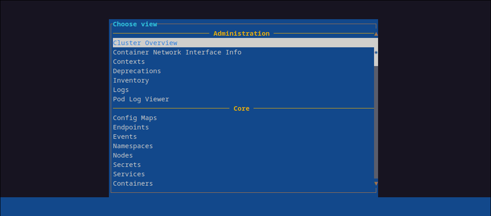
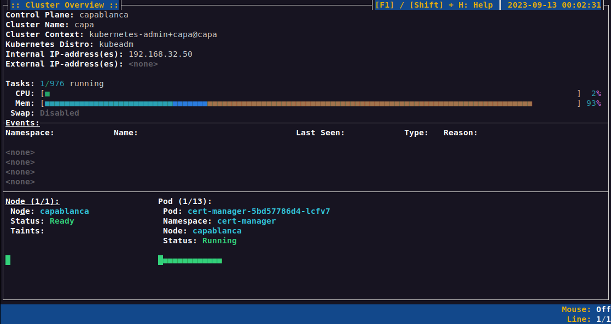
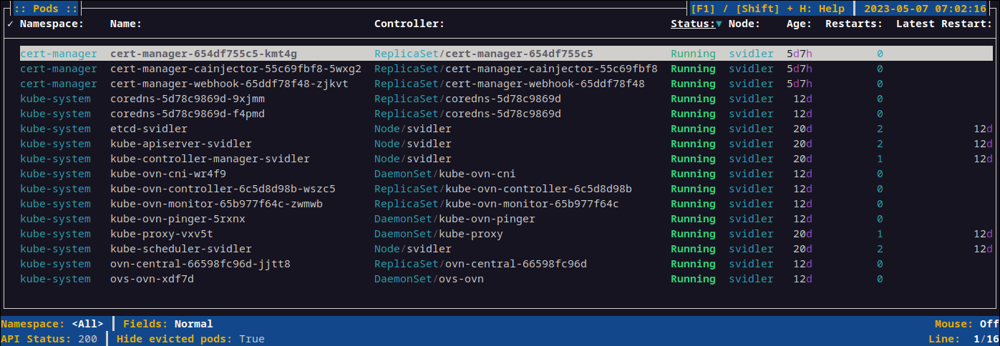
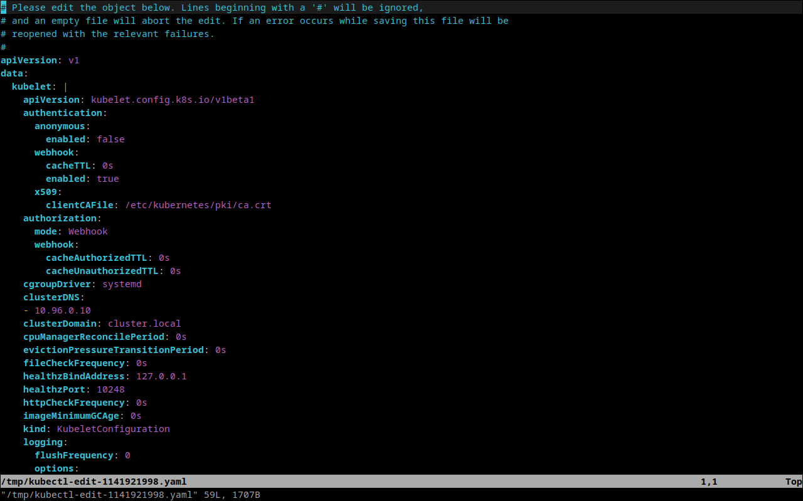
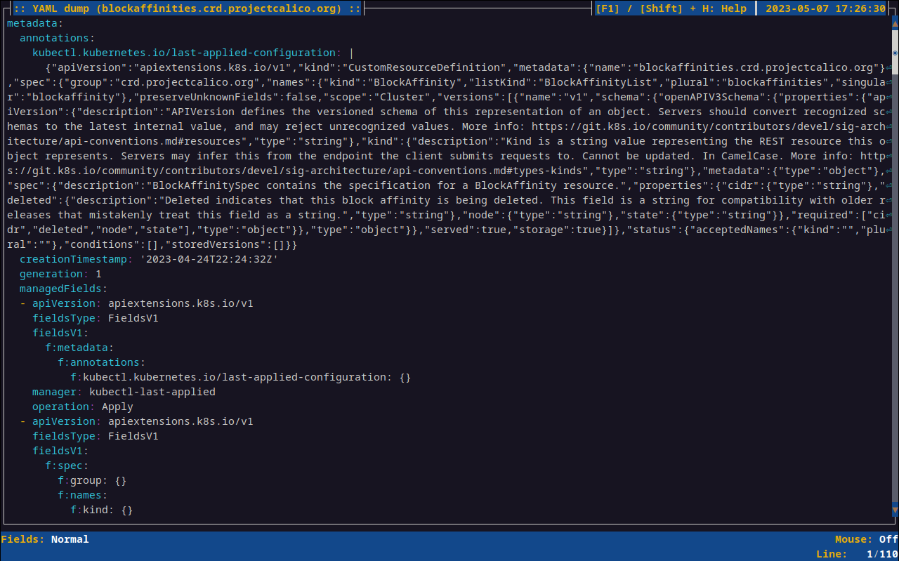
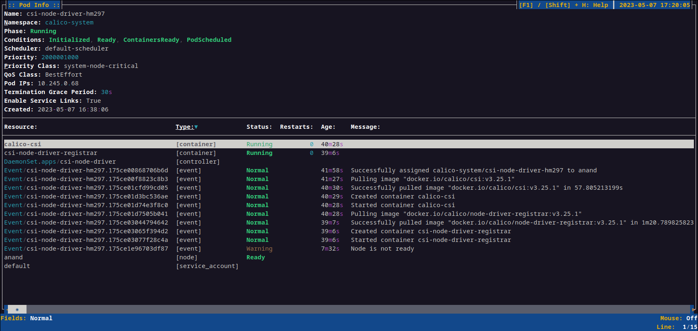
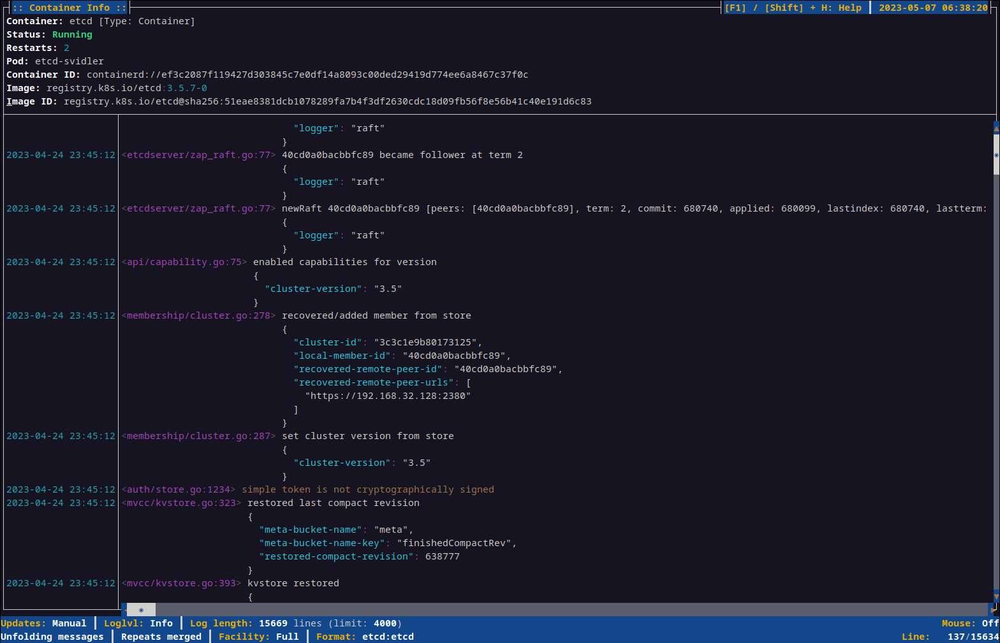
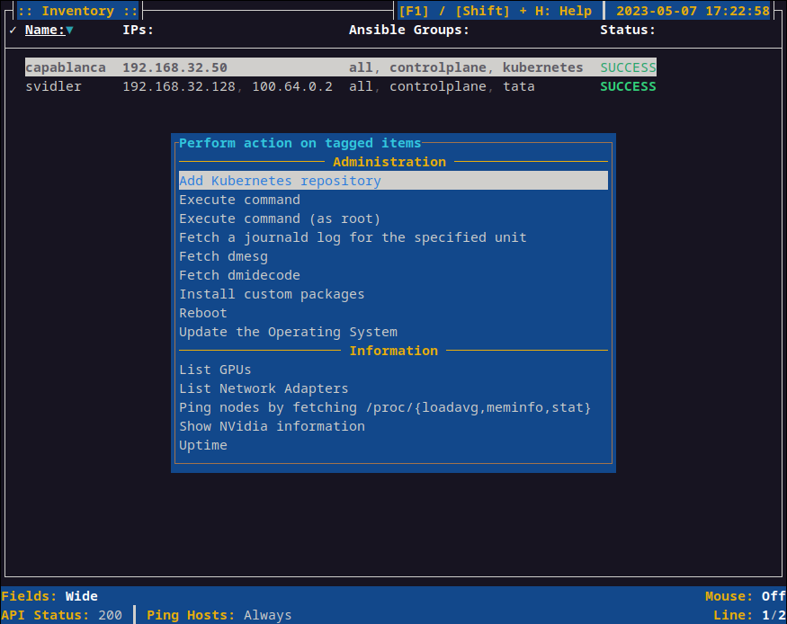

# CMU

`cmu` is the Curses-based UI for __CMT__.
It provides information in a way that is similar to the output from `kubectl get`,
`kubectl describe`, but better suitable for interactive use.
It also provides logs with formatting, and the ability to run Ansible playbooks
on both nodes in the cluster and hosts that are part of the inventory but not the cluster.

## Starting `cmu`

Simply type `cmu` to open the list of available views
(in a complex cluster configuration using APIs that __CMT__ knows about this list can be fairly extensive).

To open cmu directly in a view for a specific API resource, use `cmu po`/`cmu pod`, `cmu ns`/`cmu namespace`, etc.

To open the view list you can press `F2`.

## Getting help

To show context specific help for a particular view,
press either `F1` or `[shift] + H`. `F12` will display the "About" box.

## Read-only mode

To disable all operations that modifies the cluster you can use `cmu --read-only`.
This will prevent you from, for instance, deleting or rescaling resources,
executing some playbooks, editing resources, etc.

## Cluster overview

To get a quick overview of the health of your cluster, you can open the _Cluster Overview_,
either from the view list, or from the command line via `cmu co`.

In the Cluster overview you'll see a list of all nodes and pods highlighted based on their health.
You'll also get the CPU and memory usage of the control plane. From here you can navigate to the nodes or clusters.

## List view

The list of objects for a particular API-resource can be seen in the list view.
Here you can filter, sort, search, and in some case tag and perform actions
(for instance scaling resources or deleting them).
As always `F1` or `[shift] + H` will show what commands are available.

Some list views that contain a lot of information may be too wide for if you have a monitor with low horizontal resolution.
To accomodate for this you can press `[Shift] + W` to cycle between different view configurations.

## Edit object

If an object is mutable you can press `e` on a highlighted object in the list view to edit it.
This will open up an editor and let you edit the object. Upon exiting the editor the object will be validated,
and if the changes are acceptable the object will be updated by the API-server.

## View raw resource

You can view the YAML representation of an object by pressing `Y` in the either the List view or the Info view.
Note that the screenshot also gives an example of the optional line-wrapping functionality that can be used when logs have extremely long lines.

## Info view

The info for a particular object can be accessed by pressing `[Enter]` in the list view.
The information available in the info view is highly context specific; in some cases there is an abundance of information,
in other cases hardly anything is visible (sometimes because the view in question is a work in progress,
at other times because there's no useful way to visualise it apart from the raw YAML output).

## Log view

Some resources, notably Pods, ConfigMaps, and Logs, have a log view.

## Ansible playbooks

The Node view and the Inventory view allows you to run Ansible playbooks on selected hosts/nodes.
Based on the type of playbook they may be limited to either the Node view or the Inventory view.
Playbooks that potentially modify data will not be visible if `cmu` is running in read-only mode.
